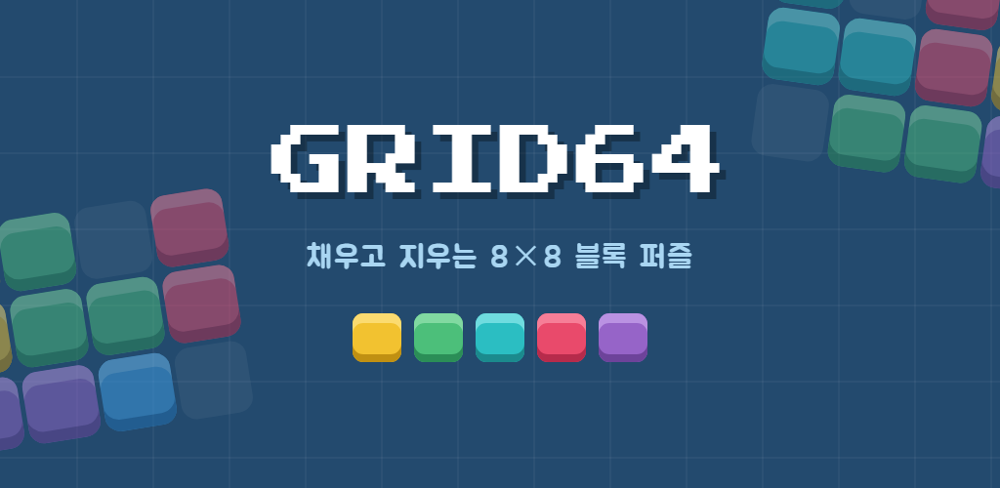
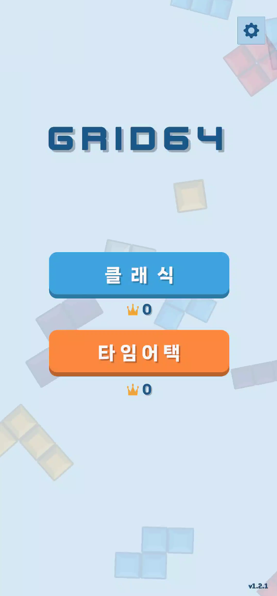
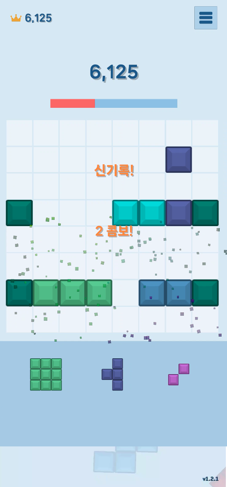
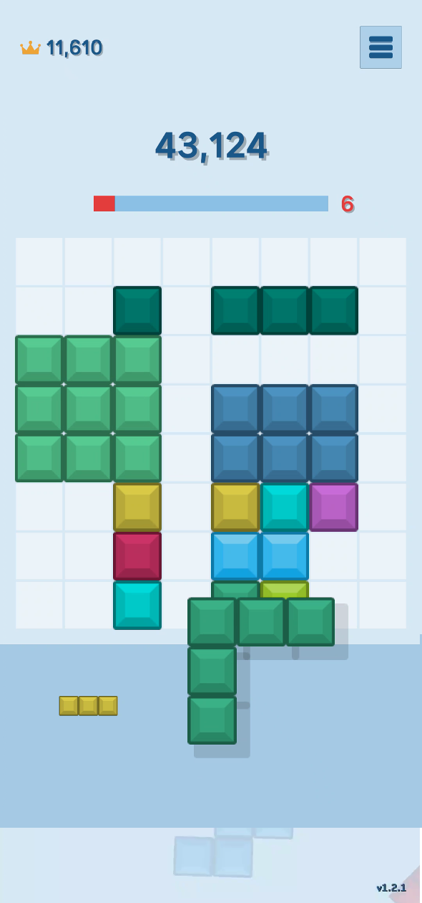
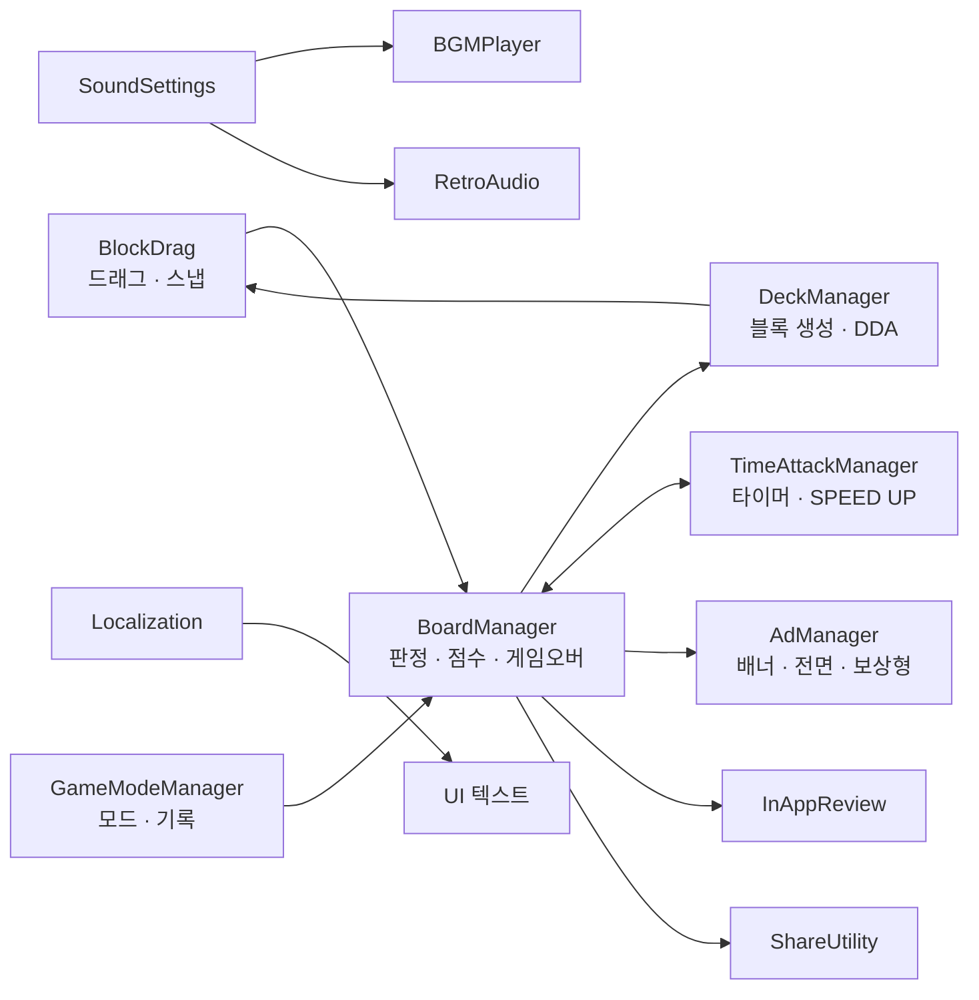

# Grid64 : 블록 퍼즐

> 8×8 보드를 채우고 지우는 블록 퍼즐. 느긋한 **클래식**과 시간에 쫓기는 **타임어택** 두 가지 모드.
> 기획부터 개발, 디자인, 테스트, Google Play 출시까지 1인으로 진행한 첫 프로젝트입니다.

<p align="center">
  
  
  
  
</p>

<p align="center">
  <a href="https://play.google.com/store/apps/details?id=com.jiniworks.grid64">Google Play에서 받기</a> ·
  <a href="https://jininh.github.io/grid64/">소개 페이지</a>
</p>

---

## 프로젝트 정보

| 항목 | 내용 |
|---|---|
| 장르 | 캐주얼 블록 퍼즐 (세로, 한 손 조작) |
| 기간 | 2026.07 ~ 2026.10 (약 3개월) |
| 인원 | 1인 (기획 · 개발 · UI 디자인 · QA · 출시) |
| 엔진 / 언어 | Unity 6.3 LTS / C# |
| 플랫폼 | Android (Google Play) |
| 연동 | Google AdMob (배너 · 전면 · 보상형), Google Play In-App Review, Android 공유 인텐트 |
| 지원 | 한국어 / 영어, 폴더블 · 태블릿 화면 |

## 주요 기능

- **클래식 모드**: 콤보, 교차 클리어(Perfect), 피버 타임(점수 2배), 올 클리어 보너스
- **타임어택 모드**: 줄을 지우면 시간 획득, 1분 후 30초마다 SPEED UP(시간 흐름·BGM·점수 배수 상승), 막혀도 즉시 종료되지 않고 보드 구제
- **동적 난이도(DDA)**: 보드의 빈칸 비율에 따라 블록 등장 가중치 조절
- **광고 부활**: 클래식 데드락 시 보상형 광고로 1회 부활 (5초 카운트다운, 자동 재생 없음)
- **기록 공유 · 인앱 리뷰**: 게임오버 화면에서 기록 공유, 조건을 만족할 때만 별점 요청

## 구조



| 구분 | 방식 |
|---|---|
| 게임 매니저 | 싱글톤 (`BoardManager`, `DeckManager`, `TimeAttackManager`, `AdManager`) |
| 전역 상태 | static 클래스 (`GameModeManager`, `SoundSettings`, `Localization`) + `Changed` 이벤트 |
| 저장 | PlayerPrefs (모드별 최고 기록, 음량, 언어, 리뷰 요청 이력) |

## 문제 해결 사례

### 1. 타임어택 데드락 구제가 실패하던 문제
- **문제**: 막혔을 때 가로 3줄만 비워줬더니, 덱에 세로로 긴 블록만 남은 경우 여전히 놓을 곳이 없어 시간만 흐르다 종료됨
- **해결**: 가로·세로 6개 후보 영역을 **가상으로 비워본 뒤 덱의 블록이 실제로 들어가는 곳만** 선택. 구제 후 다시 검사하고 실패하면 최대 3회 재시도
- **코드**: [`BoardManager.RescueBoard()`](Scripts/BoardManager.cs#L932), [`TimeAttackManager.OnDeadlock()`](Scripts/TimeAttackManager.cs#L186)
- **배운 점**: "해결했다"고 가정하지 말고 결과를 검증할 것. 상태가 막힐 수 있는 경로에는 탈출구를 둘 것

### 2. 폴더블 · 태블릿에서 화면이 잘리던 문제
- **문제**: 테스터의 폴더블 펼침 화면에서 덱이 사라지고 상단 UI가 잘림
- **해결**: 카메라 크기를 `max(가로 기준, 9:16 세로 기준)`으로 자동 계산하고, Canvas Scaler를 Expand로 변경
- **코드**: [`CameraFitter.Fit()`](Scripts/CameraFitter.cs#L41)

### 3. 고득점 플레이 중 보드가 한쪽으로 밀리던 문제
- **문제**: 라인 클리어 흔들림이 겹칠 때마다 카메라가 조금씩 밀려 누적됨
- **원인**: 새 흔들림이 "흔들리는 도중의 위치"를 원위치로 저장
- **해결**: 원위치는 흔들림이 없을 때만 저장하고, 항상 고정 기준값에서 오프셋을 줌
- **배운 점**: 겹칠 수 있는 연출은 현재 값이 아닌 고정 기준값을 기준으로 할 것

### 4. 타임어택 밸런싱
- **문제**: 1줄 콤보만 이어가도 시간이 줄지 않아 잘하는 플레이어의 판이 끝나지 않음
- **해결 과정**
  1. 콤보 시간 보너스에 상한을 둠
  2. 플레이 60초 후 30초마다 **SPEED UP** (시간 흐름 최대 ×1.5, BGM도 함께 빨라짐)
  3. 빨라진 만큼 **점수 배수**도 올려 SPEED UP을 "벌"이 아닌 "기회"로 전환
- **코드**: [`TimeAttackManager.AddTimeBonus()`](Scripts/TimeAttackManager.cs#L163), [`OnSpeedUp()`](Scripts/TimeAttackManager.cs#L345)

## 출시 과정

- 비공개 테스트: 지인 약 30명, 14일 이상 운영. 피드백을 **버그 / 편의성 / 재미** 3가지로 분류해 반영
- 테스트 기간 중 1.1.0 → 1.2.3까지 업데이트 배포 후 프로덕션 승인
- 개인정보처리방침, 오픈소스 라이선스 고지, app-ads.txt를 GitHub Pages로 직접 구성

## 폴더 안내

```
Scripts/   게임 스크립트 (원본 프로젝트의 Assets/Scripts)
docs/      스크린샷 등 문서용 이미지
```

> 이 저장소는 포트폴리오용으로 스크립트만 공개합니다. 씬, 프리팹, 그래픽, 사운드 등 에셋은 포함하지 않아 단독으로 빌드되지 않습니다.

## 라이선스 및 크레딧

- 폰트: 나눔스퀘어 네오 (SIL OFL 1.1)
- 효과음 · 배경음: Kenney (CC0), Pixabay (Pixabay Content License)
- 전체 고지: [오픈소스 라이선스](https://jininh.github.io/jiniworks-privacy/grid64-licenses.html)

---

**JiniWorks** · [개발자 홈](https://jininh.github.io)
